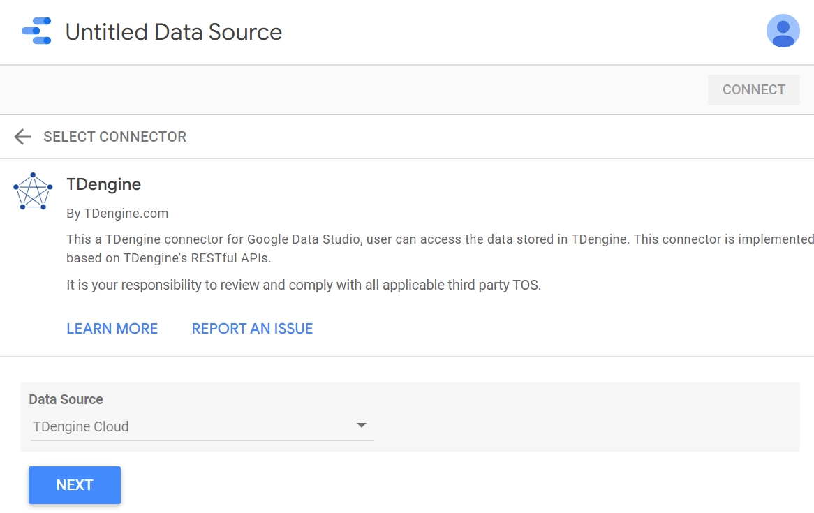

Using its [partner connector](https://datastudio.google.com/data?search=TDengine), Google Data Studio can quickly access TDengine and create interactive reports and dashboards using its web-based reporting features.The whole process does not require any code development. Share your reports and dashboards with individuals, teams, or the world. Collaborate in real time. Embed your report on any web page.

Refer to [GitHub](https://github.com/taosdata/gds-connector/blob/master/README.md) for additional information on utilizing the Data Studio with TDengine.

## Choose Data Source

The current [connector](https://datastudio.google.com/data?search=TDengine) supports two different types of data sources: TDengine Server and TDengine Cloud. Select "TDengine Cloud" and then click "NEXT".



## Connector Configuration

### Mandatory Config

#### URL

Get this URL from your cloud instance information page. Indeed, this URL's instance must be in active status.

#### TDengine Cloud Token

This token comes from your TDengine cloud and should be associated with an instance URL that is currently operational.

#### database

The database name that contains the table(no matter if it is a normal table, a super table or a child table) is the one you want to query for data and make reports on.

#### table

The name of the table that you wish to connect to in order to query its data and run a report.
**Notice** The maximum amount of records that may currently be retrieved is 1000000 rows.

### Optional config

#### Query range start date & end date

The page where we configure our connector has two text boxes.These two date filter conditions are used to limit the amount of data that will be retrieved, and the date should be entered in the format "YYYY-MM-DD HH:MM:SS."
e.g.

``` bash
2022-05-12 18:24:15
```

The query result's start timestamp is defined by the `start date`. To put it another way, records from before this `start date` won't be received.

The `end time` indicates the query result's end timestamp. Therefore, records that were written after this end date cannot be retrieved.
These conditions are utilized in the where clause in SQL statements, such as:

``` SQL
-- select * from table_name where ts >= start_date and ts <= end_date
select * from test.demo where ts >= '2022-05-10 18:24:15' and ts<='2022-05-12 18:24:15'
```

In fact, you can speed up the data loading in your report by using these filters.

Click "CONNECT" once configuration is complete, then you can connect to your "TDengine Cloud" with the given database and table.

## Create Report or Dashboard

Unlock the power of your data with interactive dashboards and beautiful reports with the data stored in TDengine.

And refer to [documentation](https://docs.tdengine.com/third-party/google-data-studio/) for more details.
